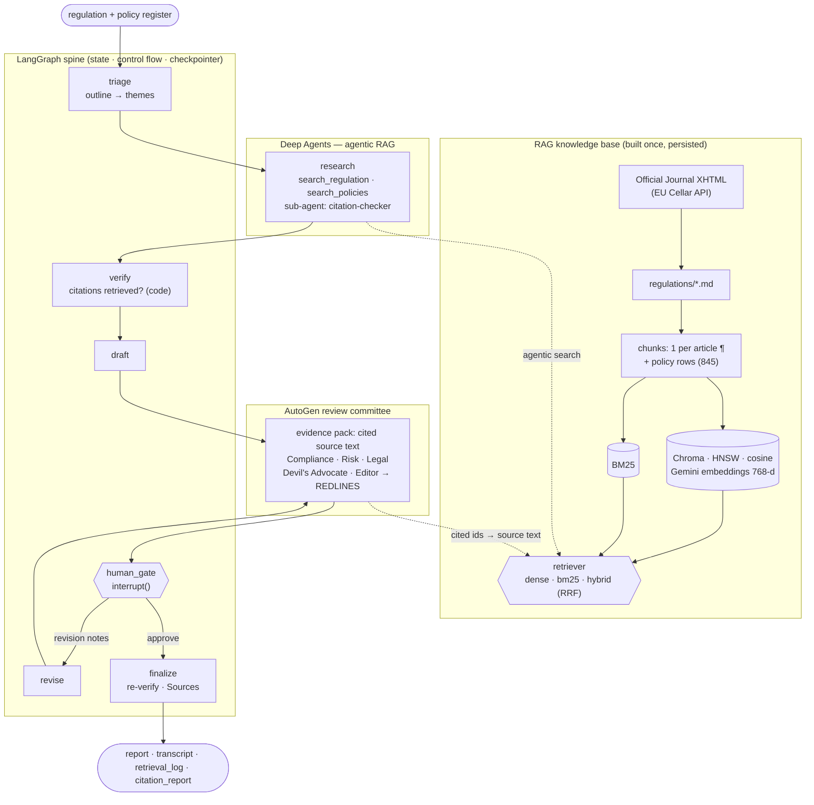

# Regulatory Change Impact Analyst

Feed it a regulation (**DORA** or the **EU AI Act**, ingested from the official
text) and a bank's internal **policy register**. It produces a board-ready
**Regulatory Impact Assessment**: what the regulation requires, which internal
policies are affected, where the gaps are, and a prioritised action list —
with every claim **cited to a specific article paragraph**, the citations
**verified against what was actually retrieved**, a **human approval gate**,
and a full **audit trail**.

RAG, LangGraph, Deep Agents and AutoGen in one system, each doing the job it's
best at:

| Component | Job in this system | Why it, and not the others |
|---|---|---|
| **RAG** — Gemini embeddings + Chroma (BM25 + RRF hybrid available) | Grounds every claim in the official text (DORA ~49k tokens, AI Act ~74k — too big to paste into prompts) | Semantic search handles paraphrased questions; the retrieval mode is chosen by a measured eval, not assumed |
| **LangGraph** | The orchestration **spine**: typed state, control flow, deterministic citation check, human-approval interrupt, checkpointing | Deterministic graph + first-class `interrupt()` + pluggable persistence |
| **Deep Agents** | The **research worker** — *agentic RAG*: plans per theme, decides what to search, re-queries, writes notes to a virtual filesystem, delegates claim checks to a sub-agent | Built for long-horizon, multi-step tool use |
| **AutoGen** | The **review committee**: Compliance / Risk / Legal / Devil's Advocate / Editor — reviewing the draft *against the retrieved source text of every provision it cites* | Multi-agent *conversation* with turn-taking and termination conditions |

📐 **Full system design: [docs/ARCHITECTURE.md](docs/ARCHITECTURE.md)** — diagrams,
RAG design decisions, evaluation, non-functional design, scaling path.
📄 A real, unedited run: [docs/example_run/](docs/example_run/).

## Architecture



## Concepts this project demonstrates

**RAG** ([regimpact/rag/](regimpact/rag/))
- **Ingestion** of structured official text by CELEX id — Chapter → Article →
  paragraph → point — into reviewable markdown.
- **Structure-aware chunking**: one chunk per article paragraph, contextual
  header, 2,000-char cap with lead-in carry-over; the chunk id *is* the legal
  citation (`dora::art19::p4` → "DORA Art. 19(4)").
- **Embeddings** with asymmetric task types (document vs query), Matryoshka
  truncation to 768-d and manual L2 normalisation.
- **Vector store**: Chroma (HNSW, cosine), metadata filtering per regulation,
  two-level staleness detection — re-embed only when embedded text or the
  model changes; refresh metadata in place otherwise.
- **Three retrieval modes** — hand-rolled BM25, dense, and hybrid via
  **Reciprocal Rank Fusion** — with the default **chosen by measurement**:
  with Gemini embeddings dense scored 100% recall@5 on 50 labelled queries
  while equal-weight hybrid scored 96% (fusing in a much weaker retriever adds
  noise); with the offline embedder hybrid wins. `auto` picks accordingly.
  Every hit reports its rank in each retriever.
- **Two RAG styles, side by side**: *agentic* in research (the Deep Agent
  formulates its own queries; tools log everything they return) and
  *retrieve-then-read* in review (the committee is handed the source text of
  every provision the draft cites).
- **Citation verification**: deterministic check that each cited id exists
  *and* was retrieved — flags recalled-from-memory and fabricated citations;
  handles grouped citations (`[a, b]`) and point references (`p3(b)`), and
  flags anything citation-shaped it can't parse rather than dropping it.
- **Retrieval eval**: recall@k and MRR for BM25 vs dense vs hybrid on 50
  hand-labelled queries, split into paraphrase and exact-term types.

| `gemini-embedding-001` | Paraphrase R@5 | Exact R@5 | All R@1 | All R@5 | MRR |
|---|---:|---:|---:|---:|---:|
| BM25 | 79% | 100% | 68% | 84% | 0.76 |
| **Dense** (default) | **100%** | **100%** | **100%** | **100%** | **1.00** |
| Hybrid (RRF) | 95% | 100% | 80% | 96% | 0.88 |

Small, author-written gold set — read the comparison, not the absolute
numbers. Details and the offline-embedder table: [ARCHITECTURE.md §5](docs/ARCHITECTURE.md#5-evaluation).

**LangGraph**
- `StateGraph` with a `TypedDict` state; `operator.add` reducer so searches from
  two different agents accumulate into one audit log.
- A deterministic node (`verify`) between two LLM nodes; `RetryPolicy` on the
  LLM nodes only.
- `add_conditional_edges` for approve → finalize / else → revise, bounded loop.
- `interrupt()` + checkpointer (`MemorySaver` → `PostgresSaver`) for
  human-in-the-loop; resume with `Command(resume=...)` on the same `thread_id`.

**Deep Agents**
- `create_deep_agent(model, tools, system_prompt=, subagents=)`.
- Built-in **planning** (`write_todos`) and **virtual filesystem**
  (`theme_<n>.md`, `findings.md`).
- A **sub-agent with its own tools** (`citation-checker` uses `get_provision`),
  running in a clean context.

**AutoGen** (`autogen-agentchat` 0.4+ API)
- `AssistantAgent` personas with distinct mandates, grounded by an evidence
  pack in the task message.
- `RoundRobinGroupChat` and composed termination
  (`TextMentionTermination | MaxMessageTermination`).
- Bridging async AutoGen into a sync LangGraph node.

## Run it

```bash
python -m venv .venv && source .venv/bin/activate
pip install -e ".[dev]"
cp .env.example .env          # add your GOOGLE_API_KEY (aistudio.google.com/apikey)
```

```bash
regimpact index                                   # embed + index the corpus (first run only; cached)
regimpact search "how fast must we report a major outage" --regulation dora
regimpact eval                                    # retrieval eval: BM25 vs dense vs hybrid
regimpact run --regulation dora                   # full pipeline, interactive approval
regimpact run --regulation eu_ai_act --auto-approve
```

No API key? `regimpact index --offline`, `regimpact search … --offline` and
`regimpact eval --offline` run the same stack with a local hashing embedder.

Add a regulation (any EU act, by CELEX number):

```bash
regimpact ingest --celex 32022R2554 --name dora \
  --title "DORA — Regulation (EU) 2022/2554 on digital operational resilience for the financial sector"
```

Outputs land in `outputs/<regulation>-<timestamp>/`: `impact_assessment.md`,
`committee_transcript.md`, `retrieval_log.json`, `citation_report.json`,
`research_files/`.

```bash
python -m pytest        # 36 tests, offline, no API key
```

## Layout

```
regimpact/
  config.py            model + embedding config, paths; one place for the API key
  state.py             LangGraph state schema
  graph.py             StateGraph assembly, retry policies, checkpointer
  nodes.py             triage · research · verify · draft · review · human_gate · revise · finalize
  research_agent.py    Deep Agent: RAG tools, retrieval log, citation-checker sub-agent
  review_committee.py  AutoGen committee: 5 agents, reviewing against an evidence pack
  evaluation.py        retrieval eval (recall@k, MRR)
  cli.py               run · index · search · eval · ingest
  rag/
    ingest.py          Official Journal XHTML -> structured markdown
    chunking.py        article-paragraph chunks, contextual headers, policy rows
    embeddings.py      Gemini embedder (+ offline hashing embedder)
    bm25.py            lexical retriever
    store.py           Chroma vector store, staleness detection
    retriever.py       hybrid retrieval + Reciprocal Rank Fusion
    knowledge_base.py  the facade the agents use
    verify.py          citation verification
data/
  regulations/         dora.md, eu_ai_act.md — official text (Articles), EU Cellar
  policies/            policy_register.csv — synthetic
  eval/                retrieval_gold.json — 38 labelled questions
docs/
  ARCHITECTURE.md      system design
  example_run/         a real run's outputs
tests/
```

## Notes / honest limitations

- `data/regulations/` holds the **official enacting terms** (Articles) of
  Regulation (EU) 2022/2554 and 2024/1689, from the EU Publications Office —
  © European Union, reuse authorised with attribution. Recitals and annexes
  are not ingested; only the Official Journal version is authentic. The policy
  register is invented.
- **Provider: Google Gemini** — one key drives everything: generation via
  `langchain-google-genai`; AutoGen via Gemini's OpenAI-compatible endpoint
  (same `OpenAIChatCompletionClient`, different `base_url`); embeddings via
  `google-genai`. Swapping providers only touches `config.py` and
  `rag/embeddings.py`. (`langchain-anthropic` stays a dependency — `deepagents`
  imports it at load time.)
- **AutoGen + Gemini 3 tool calls don't mix (yet)**: Gemini 3 requires the
  "thought signature" on each function call to be sent back on the next turn;
  through the OpenAI-compatible endpoint it lives in a vendor extension field
  that AutoGen's `OpenAIChatCompletionClient` drops, so the turn after any tool
  call fails with a 400. That's why review uses retrieve-then-read rather than
  giving a committee member a search tool. (The Deep Agent is unaffected — it
  uses Google's native LangChain client, which round-trips signatures.)
- **Dependency pins**: `protobuf~=5.29` and `googleapis-common-protos<1.70`
  resolve a genuine conflict between AutoGen and Chroma's telemetry stack
  (see `pyproject.toml`).
- **Free-tier reliability**: occasional `503 high demand`, a daily generation
  quota, and an embedding tokens-per-minute cap (the first `regimpact index`
  takes a few minutes as it backs off). LLM nodes have a `RetryPolicy`; the
  embedder honours the server's retry hint.
- **Deep Agents' virtual filesystem** keys files by the absolute working
  directory (e.g. `/Users/you/project/findings.md`). `_persist` and
  `_file_text` match on the basename — an earlier version missed `findings.md`
  entirely and drafted from the agent's 3-sentence summary, producing wrong
  policy titles; that's the bug that motivated deterministic citation checks.
