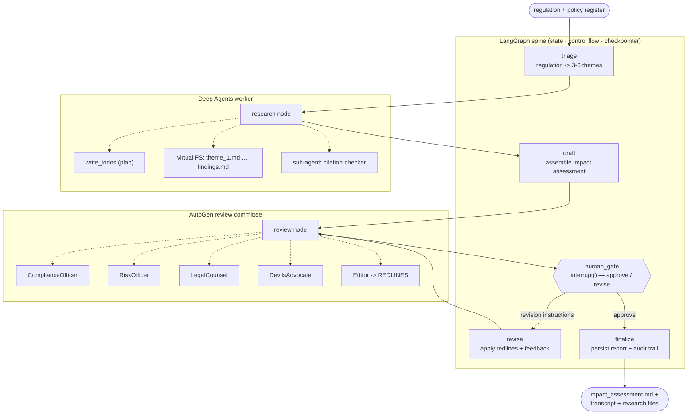

# Regulatory Change Impact Analyst

Feed it a regulation (DORA, the EU AI Act, …) and a bank's internal **policy
register**. It produces a board-ready **Regulatory Impact Assessment**: what the
regulation requires, which internal policies are affected, where the gaps are,
and a prioritised action list — with a **human approval gate** and a full
**audit trail**.

The point of the project is to use three agent frameworks *for the thing each is
actually best at*, and to keep the seams between them clean.

| Framework | Job in this system | Why it, and not the others |
|---|---|---|
| **LangGraph** | The orchestration **spine**: typed state, control flow, the human-approval interrupt, checkpointing / audit trail | Deterministic graph + first-class `interrupt()` + pluggable persistence |
| **Deep Agents** | The **deep-research worker**: plans themes, delegates to a sub-agent, writes notes to a virtual filesystem, emits `findings.md` | Built for long-horizon tasks that outgrow one context window |
| **AutoGen** | The **review committee**: Compliance / Risk / Legal / Devil's-Advocate agents debate the draft; an Editor consolidates redlines | Multi-agent *conversation* with turn-taking and termination conditions |

See a real, unedited run: [docs/example_run/](docs/example_run/).

## Architecture



## Concepts this project demonstrates

**LangGraph**
- `StateGraph` with a `TypedDict` state and per-field reducers (last-write-wins here).
- Nodes as pure `state -> partial update` functions; wiring lives only in `graph.py`.
- `add_conditional_edges` for branching (approve → finalize, else → revise) with a
  bounded revision loop.
- `interrupt()` + a **checkpointer** (`MemorySaver`, swappable for `SqliteSaver`
  / `PostgresSaver`) for human-in-the-loop and resumable runs.
- The interrupt/resume loop in `cli.py`: re-invoke with `Command(resume=...)` and
  the same `thread_id`.

**Deep Agents**
- `create_deep_agent(model, tools, system_prompt=, subagents=)`.
- The built-in **planning** tool and **virtual filesystem** — the agent writes
  `theme_<n>.md` files and a consolidated `findings.md`, which we lift out of the
  final state for the audit trail.
- A **sub-agent** (`citation-checker`) that runs with its own context so search
  dumps don't pollute the main thread.
- Graceful tool degradation: `search_regulatory_context` uses Tavily if
  `TAVILY_API_KEY` is set, otherwise returns a labelled stub so the demo runs
  offline.

**AutoGen** (`autogen-agentchat` 0.4+ API)
- `AssistantAgent` personas with distinct mandates.
- `RoundRobinGroupChat` (deterministic turn-taking) vs. `SelectorGroupChat`
  (LLM-chosen speaker) — and why round-robin here.
- `TerminationCondition` composition: `TextMentionTermination("REDLINES_COMPLETE")
  | MaxMessageTermination(12)`.
- Bridging async AutoGen into the sync LangGraph node with a small `asyncio.run`
  wrapper.

## Run it

```bash
python -m venv .venv && source .venv/bin/activate
pip install -e .
cp .env.example .env          # add your GOOGLE_API_KEY (aistudio.google.com/apikey)
```

```bash
# interactive: you get the draft + committee redlines, then approve or type edits
regimpact --regulation dora

# non-interactive demo
regimpact --regulation dora --auto-approve

# bring your own regulation: drop a markdown file in data/regulations/
regimpact --regulation eu_ai_act
```

Outputs land in `outputs/<regulation>-<timestamp>/`:
`impact_assessment.md`, `committee_transcript.md`, `research_files/`.

```bash
python -m pytest        # structural tests, no API key needed
```

## Layout

```
regimpact/
  config.py            model factories for LangChain + AutoGen, one place for the API key
  state.py             the LangGraph state schema (concepts in the docstring)
  graph.py             StateGraph assembly + checkpointer
  nodes.py             the 7 node functions + the routing function
  research_agent.py    Deep Agents worker: tools, sub-agent, system prompt
  review_committee.py  AutoGen committee: 5 agents, team, termination
  cli.py               entrypoint + interrupt/resume loop
data/
  regulations/*.md     synthetic, paraphrased study excerpts (not legal text)
  policies/policy_register.csv   synthetic internal policy list
tests/
```

## Notes / honest limitations

- The regulation excerpts under `data/regulations/` are **paraphrased summaries
  written for this demo**, not legal text. The policy register is invented.
- No retrieval backend is wired by default; `search_regulatory_context` is a stub
  unless you add a Tavily key. The intended production swap is an internal
  document store.
- **Provider: Google Gemini**, on purpose — one free-tier-friendly key drives all
  three frameworks. LangGraph/Deep Agents use `langchain-google-genai` directly;
  AutoGen has no native Gemini client, so `review_committee.py` points AutoGen's
  `OpenAIChatCompletionClient` at Gemini's OpenAI-compatible endpoint
  (`generativelanguage.googleapis.com/v1beta/openai/`) instead — same client,
  different `base_url`. Model id defaults to `gemini-3.5-flash-lite`; override with
  `REGIMPACT_MODEL`. Swapping back to Anthropic/OpenAI later only touches
  `config.py`. (`langchain-anthropic` stays a dependency regardless — `deepagents`
  imports it internally at load time even when you pass it a different model.)
- **Free-tier reliability**: expect occasional `503 high demand` errors and, on
  a busy day, the 500-requests/day free quota for a given Gemini model — this
  pipeline is chatty (each Deep Agent tool-call round-trip and each of the 5
  committee agents is its own request). `graph.py` attaches a `RetryPolicy` to
  every LLM-calling node for the former; for the latter, either wait for the
  daily reset or point `REGIMPACT_MODEL` at a different model / paid tier.
