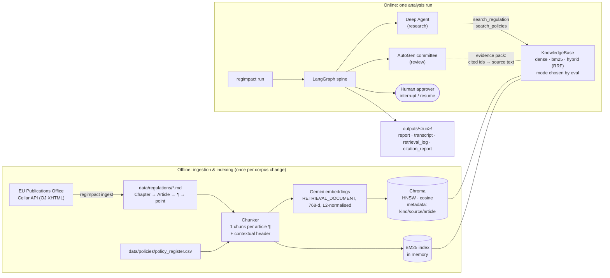
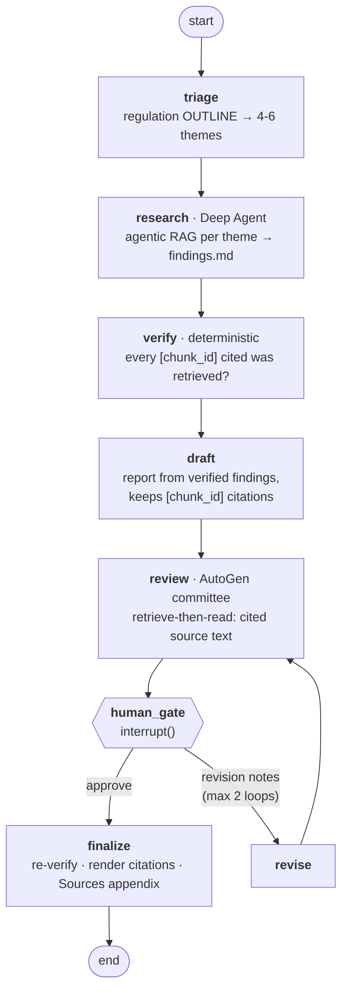
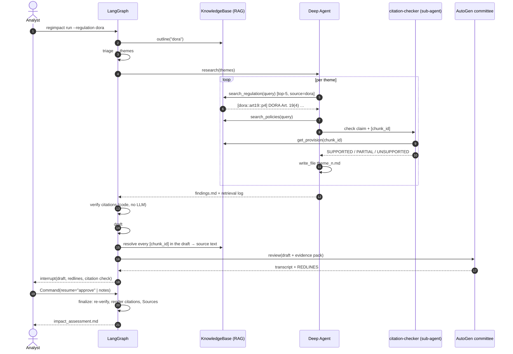

# Architecture & System Design

Regulatory Change Impact Analyst: give it a regulation (DORA, the EU AI Act) and
a bank's internal policy register; it produces a board-ready impact assessment
whose every claim cites a specific article paragraph — retrieved, verified, and
approved by a human before it's final.

Four techniques, each doing the job it's best at:

| Component | Role | Why this tool for this job |
|---|---|---|
| **RAG** (Gemini embeddings + Chroma; BM25 + RRF hybrid available) | Grounds every claim in the official regulation text | The regulations are ~49k and ~74k tokens — too big to paste into prompts, and paraphrase-heavy questions need semantic search |
| **LangGraph** | Orchestration spine: typed state, control flow, human approval, checkpointing | Deterministic graph, first-class `interrupt()`, pluggable persistence = audit trail |
| **Deep Agents** | Research worker: plans per theme, *decides what to retrieve*, writes notes to a virtual filesystem, delegates claim checks to a sub-agent | Long-horizon, multi-step tool use — agentic RAG |
| **AutoGen** | Review committee: Compliance / Risk / Legal / Devil's Advocate / Editor, reviewing the draft against the retrieved source text of every provision it cites | Multi-agent conversation with turn-taking and termination |

---

## 1. High-level architecture

## 2. The LangGraph workflow

* State is a `TypedDict` (`regimpact/state.py`). Most fields are last-write-wins;
  `retrieval_calls` uses an `operator.add` reducer, so searches by the research
  agent *and* the committee accumulate into one audit log.
* Every LLM-calling node has a `RetryPolicy` (4 attempts, exponential backoff);
  `verify` deliberately has none — it's deterministic, so a failure is a bug.
* `MemorySaver` checkpoints after every step, keyed by `thread_id`; that's what
  makes `interrupt()` resumable. Swap in `SqliteSaver`/`PostgresSaver` for
  durable, multi-process runs with no other change.

## 3. One run, end to end

## 4. RAG design decisions

### 4.1 Ingestion — structured official text, not scraped HTML
* Source: Official Journal XHTML from the EU Publications Office **Cellar**
  endpoint (`publications.europa.eu/resource/celex/{CELEX}`, content
  negotiation). The eur-lex.europa.eu UI answers scripts with an empty `202`
  (bot check); Cellar is the documented machine endpoint for the same text.
* Kept: Articles only, with Chapter → Article → numbered paragraph → lettered
  point structure. Dropped: recitals, footnote markers, annexes.
* Intermediate format is markdown in git (`data/regulations/`): reviewable,
  diffable when the law is amended, and the chunker doesn't depend on HTML.

### 4.2 Chunking — legal structure, not token windows
| Decision | Alternative | Why |
|---|---|---|
| 1 chunk per **numbered article paragraph** | fixed 512-token windows + overlap | A paragraph is the unit compliance cites; never splits an obligation; the chunk id *is* the citation (`dora::art19::p4` → "DORA Art. 19(4)") |
| **Contextual header** prepended ("DORA — Article 19: Reporting of major ICT-related incidents… / CHAPTER III …") | bare paragraph text | "2. Financial entities may…" says nothing about its topic; the header gives BM25 and the embedder the subject words |
| **2,000-char cap**, split at line boundaries, **lead-in line repeated** in each part | truncate, or one giant chunk | Art. 3 is ~65 definitions in one paragraph; a lone "(f) exit strategies…" keeps meaning when it carries "The contractual arrangements shall include…" |
| Policies: **1 chunk per register row** | — | Each row is already one citable policy |

Corpus: **845 chunks** — DORA 290, AI Act 543, policies 12 (median ~550 chars).

### 4.3 Embeddings
* `gemini-embedding-001`, **768 dims** (Matryoshka truncation of 3,072 —
  4× smaller index, small quality cost).
* **Asymmetric task types**: `RETRIEVAL_DOCUMENT` for chunks,
  `RETRIEVAL_QUERY` for questions — questions and the passages answering them
  are phrased differently, and the model embeds each for its role.
* **Manual L2 normalisation**: truncated vectors come back with norm ≈ 0.59
  (measured), not 1. Normalising makes cosine similarity equal the dot product.
* `gemini-embedding-2` was rejected: it's multimodal and merges a list input
  into **one** embedding, so it can't batch-embed chunks.
* Batching (100/request) + honouring the server's `retry in Ns` hint on 429s
  (free tier caps embedding tokens per minute). Query vectors are LRU-cached.
* `HashingEmbedder` (character n-gram feature hashing) runs the identical
  stack offline for tests and CI.

### 4.4 Vector store — Chroma
* **HNSW** approximate nearest-neighbour index, **cosine** space; Chroma
  returns distance = 1 − cosine.
* **Metadata filtering** (`kind`, `source`, `article`): a DORA run can only
  retrieve DORA; policy search only sees policies.
* **Persistent** (`data/index/`): embeddings are paid for once.
* **Staleness detection, two levels**: the collection records the embedder
  name and a SHA-256 fingerprint of what is *embedded* (chunk ids + text) —
  any change there (amended law, new policy, different model) re-embeds,
  because vectors from different models or texts aren't comparable. A second
  fingerprint covers the filterable *metadata*; when only that changes (e.g. a
  citation label), metadata is updated in place and nothing is re-embedded —
  minutes and quota saved on a free tier, real money at scale.
* Telemetry disabled (`anonymized_telemetry=False`).

At 845 chunks brute force would also be fast; Chroma is chosen for what the
system needs at scale (ANN, filters, persistence), not for the demo's size.

### 4.5 Retrieval — three modes, default chosen by measurement
* **BM25** (hand-rolled, ~40 lines): exact terms — "TLPT", "Lead Overseer",
  article numbers, "3 years". Misses paraphrase.
* **Dense** (Gemini + Chroma): paraphrase — "outage" ≈ "ICT-related
  incident", "pay for being overseen" ≈ "oversight fees".
* **Hybrid / RRF**: `score(d) = Σ 1/(60 + rank_r(d))` over both lists (depth
  30). Fuses *ranks*, so unbounded BM25 scores and bounded cosine scores never
  need normalising. A chunk both retrievers like beats a chunk only one ranks first.
* **Default (`auto`)**: dense with Gemini, hybrid with the offline embedder —
  the configuration that won the eval for each (§5). Switching is one env var.
* Every hit carries its BM25 rank and dense rank — `regimpact search --mode
  hybrid` shows them, which is how you debug "why did this paragraph come back?".

### 4.6 Two RAG styles — agentic in research, retrieve-then-read in review
* **Agentic (research).** Classic RAG is one fixed step (embed the question →
  top-k → generate). Here the Deep Agent issues its own queries per theme,
  re-queries with different wording when results miss, and delegates
  load-bearing claims to a `citation-checker` sub-agent that re-fetches the
  cited provision (`get_provision`). Right for open-ended exploration.
* **Retrieve-then-read (review).** Before the AutoGen debate, the `review`
  node resolves every `[chunk_id]` in the draft to its source text and puts
  that evidence pack in the committee's task. Deterministic, no extra model
  calls, and it checks *every* citation rather than the ones an agent chooses
  to look up. Right for verification.
* **Why the committee has no search tool.** It had one first. Gemini 3
  attaches a *thought signature* to every function call and rejects the next
  request unless it's sent back; via the OpenAI-compatible endpoint the
  signature is a vendor extension field that AutoGen's
  `OpenAIChatCompletionClient` drops, so the turn after any tool call returned
  `400 … missing a thought_signature`. The Deep Agent is unaffected (Google's
  native LangChain client round-trips signatures). Retrieve-then-read was the
  better design for review anyway.
* The evidence pack is logged in `retrieval_calls` as `review_evidence`, but is
  **excluded** when verifying citations — it's fetched *from* the draft's
  citations, so counting it would mark every real citation "verified".
* Triage never sees the full text — only the outline (chapter/article titles,
  ~1k tokens), which is enough to choose themes.

### 4.7 Grounding you can check — deterministic citation verification
The agent must cite `[chunk_id]`s. Tools are closures that log every chunk
they return. The `verify` node (code, no LLM) classifies each citation:

| Status | Meaning |
|---|---|
| `verified` | exists in the corpus **and** was retrieved in this run |
| `not_retrieved` | real provision, never retrieved — recalled from model memory, not read |
| `unknown` | id doesn't exist — fabricated |

Unverified citations are passed to `draft` as "do not rely on these", re-checked
on the approved report in `finalize`, and visibly marked `[… — unverified]` in
the output.

The parser accepts grouped citations (`[dora::art5::p2.2, dora::art6::p1]`),
which is how models usually write them. The first live run parsed one id per
bracket only: it reported 15/15 citations verified when findings.md actually
held 25, silently skipped every grouped regulation citation in the final
report, and — because the review evidence pack is built from the draft's
citations — handed the committee policy rows but no DORA text. The next run
found one more variant: a point reference, `[dora::art17::p3(b)]`, was again
skipped — and the committee, never shown Art. 17(3), told the board it
"does not exist". Point suffixes are now normalised (`p3(b)` → `p3`, with
"(b)" kept in the rendered citation), and the governing rule is: **anything
citation-shaped that can't be parsed is flagged `unknown`, never dropped.** A
verifier that undercounts looks exactly like a verifier that passes; each of
these paths now has a regression test. Motivation: an earlier version of this pipeline drafted from the
agent's 3-sentence summary instead of its findings file (a filesystem-path
bug) and produced a report with three **wrong policy titles** — nothing
caught it. Citation verification makes that class of error visible.

## 5. Evaluation

Retrieval is evaluated separately from generation (`regimpact eval`), so a bad
report can be attributed to *retrieval* (the right article never arrived) or
*generation* (it arrived and was misread).

* Gold set: `data/eval/retrieval_gold.json` — 50 queries, two types:
  **paraphrase** (38) phrased the way an analyst asks, deliberately *not*
  reusing the article's wording; **exact** (12) terse keyword queries using
  the regulation's own defined terms ("Joint Examination Team", "TLPT",
  "post-market monitoring plan"). Every label was checked against the article
  text.
* Metrics: recall@1/3/5 (article-level) and MRR. recall@5 is operational: the
  agent's search tool returns 5 chunks.

**Gemini `gemini-embedding-001` (768-d)** — the configuration the agents use:

| Retriever | Paraphrase R@1 | Paraphrase R@5 | Exact R@1 | Exact R@5 | All R@5 | All MRR |
|---|---:|---:|---:|---:|---:|---:|
| BM25 | 61% | 79% | 92% | 100% | 84% | 0.76 |
| **Dense** | **100%** | **100%** | **100%** | **100%** | **100%** | **1.00** |
| Hybrid (RRF, equal weights) | 74% | 95% | 100% | 100% | 96% | 0.88 |

**Offline hashing embedder** (character n-grams, no semantics):

| Retriever | Paraphrase R@5 | Exact R@5 | All R@1 | All R@5 | All MRR |
|---|---:|---:|---:|---:|---:|
| BM25 | 79% | 100% | 68% | 84% | 0.76 |
| Dense | 74% | 92% | 58% | 78% | 0.68 |
| **Hybrid** | **84%** | 92% | 66% | **86%** | 0.74 |

**What this changed.** I built hybrid expecting it to win — it did in
danish-legal-checker, whose dense side was a weak character-TF-IDF embedder,
and it does here with the hashing embedder. With a strong semantic embedder it
*loses*: equal-weight RRF rewards agreement between lists, so a wrong chunk
ranked BM25 #1 + dense #3 (1/61 + 1/63 = 0.032) beats the right chunk ranked
dense #1 alone (1/61 = 0.016). When one retriever dominates, the other's
"agreement" is noise. Fusion helps when retrievers are comparably good and
fail differently; it hurts when they aren't.

So retrieval mode is configurable (`REGIMPACT_RETRIEVAL_MODE`), and `auto`
(default) resolves per embedder: **dense** for Gemini, **hybrid** for the
offline embedder. BM25 and fusion stay implemented, tested and one setting
away — the right default would be re-measured on real analyst queries,
especially identifiers dense models are known to blur (article cross-references,
regulation numbers like "2022/2554").

**Caveats:** 50 queries, written and labelled by the system's author, one
topic per question — absolute numbers are optimistic. The comparison
*between* retrievers on the same queries is the useful signal. A "relevant"
chunk sitting at cosine ≈0.70–0.74 while an unrelated query ("best recipe for
chocolate cake") still scores ≈0.46 against DORA shows why raw similarity
scores aren't used as cut-offs — only ranks.

## 6. Non-functional design

| Concern | Design |
|---|---|
| **Reliability** | `RetryPolicy` on LLM nodes; Gemini SDK retries; embedding calls back off per the server's retry hint; AutoGen client created per review (a cached client would already be closed on the second review of a revise loop) |
| **Cost / quotas** | Index built once and persisted; query embeddings LRU-cached; triage reads a ~1k-token outline instead of ~49k tokens of law (DORA; AI Act ~1.8k vs ~74k); top-5 retrieval keeps prompts small; free-tier generation quota (≈500 req/day) is the binding constraint for full runs |
| **Auditability** | Every run writes `retrieval_log.json` (each query, by which agent, which chunks), `citation_report.json`, the committee transcript and the agent's notes; LangGraph checkpoints every state transition; optional LangSmith tracing |
| **Security & privacy** | Secrets only in `.env` (gitignored); Chroma telemetry off; no customer data — synthetic policy register, public regulations; corpus is EU law (reuse authorised with attribution) |
| **Human control** | Nothing is final without `interrupt()` approval; revisions bounded at 2 loops |
| **Testability** | 36 offline tests (parser, chunker, BM25, RRF, Chroma store, filters, two-level freshness, mode selection, citation verifier incl. grouped citations, review evidence, graph wiring) — no network, no key |

## 7. Scaling path

| Concern | Now | At scale |
|---|---|---|
| Corpus | 2 regulations, 845 chunks | All EU financial regulation + RTS/ITS + national transpositions (~10⁵–10⁶ chunks): same ingester by CELEX, scheduled |
| Vector store | Embedded Chroma | Chroma server / pgvector / Qdrant; tune HNSW `ef_search` for recall vs latency; shard by regulation |
| Retrieval quality | Dense (eval-selected); hybrid available | + cross-encoder re-ranker on top-30; weighted fusion re-tuned on real analyst queries; query rewriting for multi-hop questions |
| Freshness | Rebuild on fingerprint change | Incremental upsert of changed chunk ids (ids are stable across amendments); change-impact alerts (cf. danish-legal-checker's monitor) |
| Throughput | One run at a time | Parallel themes (LangGraph `Send` fan-out); paid tier; queue + workers |
| Persistence | `MemorySaver` | `PostgresSaver` — durable checkpoints, resumable human approvals across processes |
| Policies | 12-row CSV | Full policy library: chunk documents like regulations, per-business-unit metadata filters, access control on the index |

## 8. Limitations (stated, not hidden)

* Annexes aren't ingested (the AI Act's Annex III — the high-risk use-case list
  that includes credit scoring — is referenced by Article 6 but not indexed).
* Article-level relevance in the eval; no paragraph-level gold labels yet.
* The policy register is synthetic and tiny; policy retrieval is exercised but
  not meaningfully stress-tested.
* Free-tier Gemini: occasional 503s and daily quotas; full runs are slow.
* No re-ranker; hybrid uses equal RRF weights (and loses to dense with Gemini).
* The retrieval eval is small (50 queries) and author-written; see §5 caveats.
